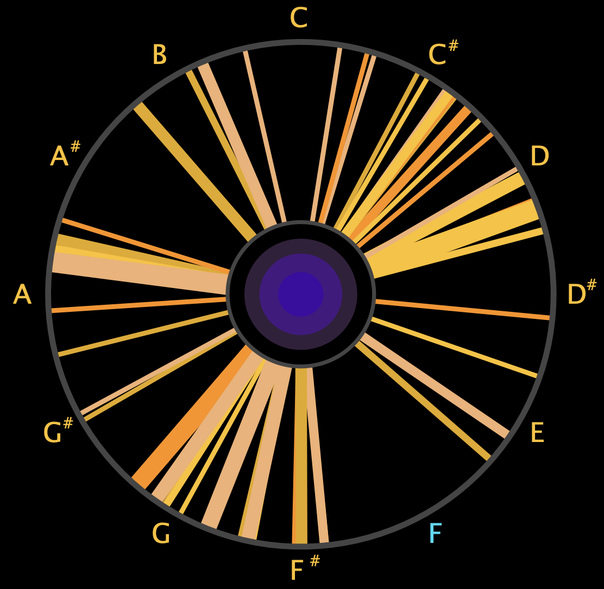
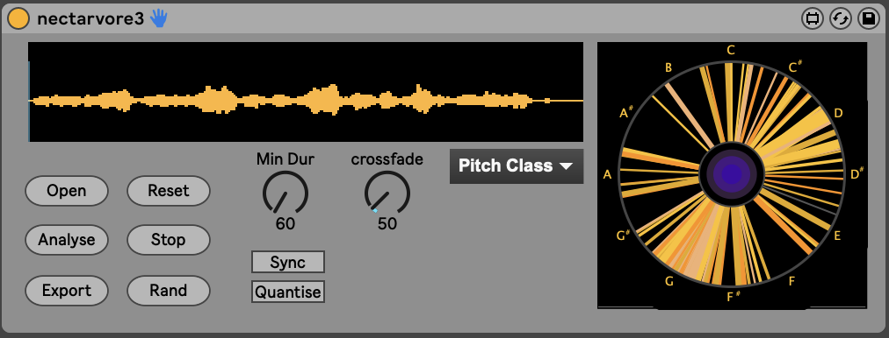

# Welcome!

## About
Nectarvore is a pitch sensitive sampler. It uses automatic pitch detection to listen to an audio file and determine which pitches are present. After analysing a file you can then play back the detected notes in a few different ways.

## Demo
For a tutorial on how to install and use Nectarvore, check out this video:
https://youtu.be/NdRKnEIHllU

## Licence
This software is released under the Music Software Public Licence (v1.1).
Free for personal, educational, or research use (but if you wish to support future developments you can do so below)
- Commercial use requires a paid licence.
- You may not modify, adapt, or redistribute the Software for commercial purposes without permission.
- To obtain a commercial licence or discuss custom terms, please contact:
 gregoryolleyaudio@gmail.com
- By downloading, using, or modifying this code, you agree to the terms of the Music Software Public Licence [\[link\]](https://github.com/gregattack/nectarvore/blob/7335fdb44952d18c630e02da0e59caddbaff4117/licence.txt).

## Instillation
The best and easiest way to download and install Nectarvore is to navigate to the 'Releases' page on Github (right side of the screen).
Navigate to the latest release and download the 'Nectarvore.zip' file.
Unzip this file somewhere on your computer and make sure to keep all of the resulting files in the same place.
To use it simply drag and drop 'nectarvore3.amxd' onto an empty midi track in Ableton.

Alternatively you can download the following files and place somewhere on your computer. Make sure they are all in the same folder.
- nectarvore3.amxd
- nectarvore3.js
- interface.js
- sampPlayback.maxpat
- record_button.jpg

## Development
Nectarvore is currently in alpha. If you wish to get involved please get in contact at: gregoryolleyaudio@gmail.com 

Thanks! And have fun playing!
